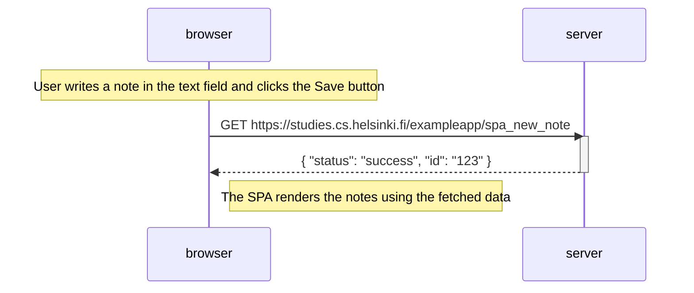

```mermaid
sequenceDiagram
    participant browser
    participant server
 
    Note over browser: User writes a note in the text field and clicks the Save button
 
    browser->>server: GET https://studies.cs.helsinki.fi/exampleapp/spa_new_note
    activate server
    server-->>browser: { "status": "success", "id": "123" }
    deactivate server
 
    Note right of browser: The SPA renders the notes using the fetched data
```